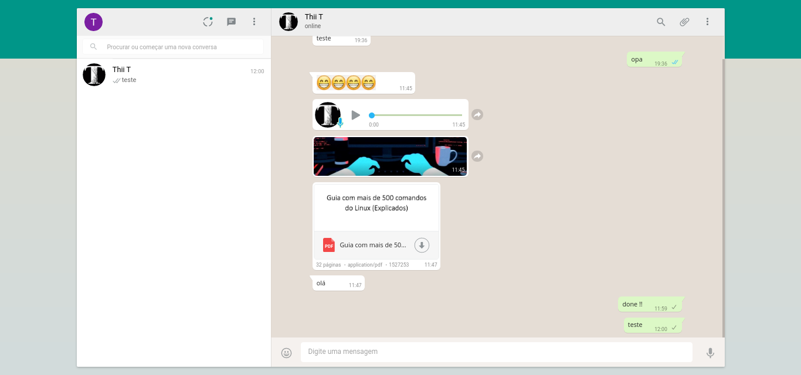
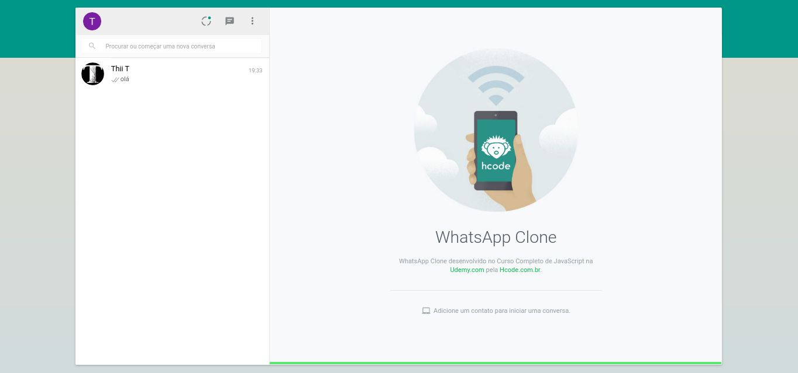
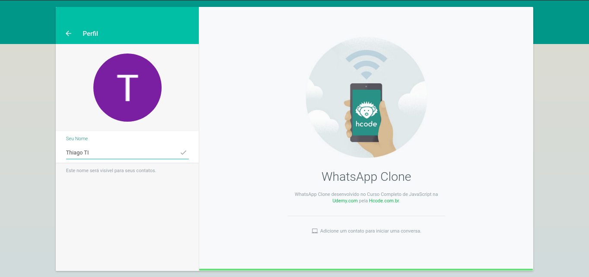
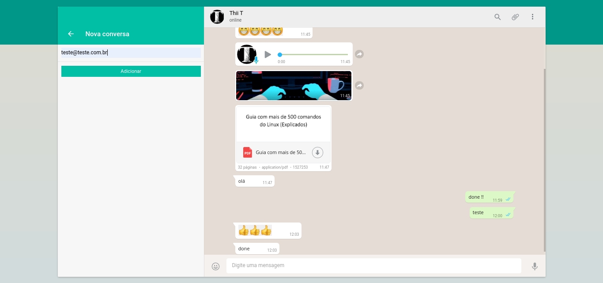
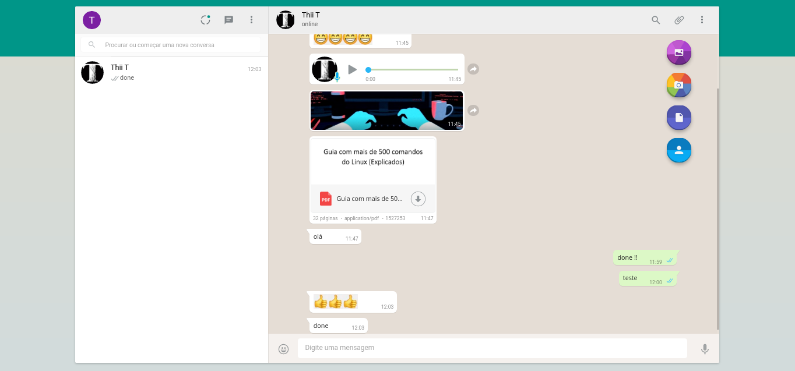

# Projeto WhatsApp Clone


Projeto desenvolvido no curso de javascript da [Hcode Treinamentos](https://www.hcode.com.br)


---

## 🎨 Layout

### Projeto

<p alingn="center">  </p>

<p>
  
  
  
  
</p>

---

### Funcionalidades

- envio e recebimento de mensagens
- envio de anexos em pdf, imagens, docs e etc...
- messagem de audio
- captura de imagem pela webcam e envio
- emojis

entre outras...

---

### Recursos Usados

Lista de recursos usados para este projeto

[Webpack](https://webpack.js.org/) <br />
[Firebase Authentication](https://firebase.google.com/docs/auth/?authuser=0) <br />
[Cloud Firestore](https://firebase.google.com/docs/firestore/?authuser=0) <br />
[Cloud Functions](https://firebase.google.com/docs/functions/?hl=pt-br) <br />
[Cloud Storage](https://firebase.google.com/docs/storage/?authuser=0) <br />
[PDF.js](https://mozilla.github.io/pdf.js/) <br />
[MediaDevices.getUserMedia()](https://developer.mozilla.org/en-US/docs/Web/API/MediaDevices/getUserMedia) <br />

---

### 💻 Executando

Instale as dependências

```bash
$ npm install
```

Rode a aplicação

```bash
$ npm start
```

<strong> Sevidor:  </strong>

http://localhost:8080

---

Esse projeto está sob a licença MIT. Veja o arquivo [LICENSE](/LICENSE.md) para mais detalhes.